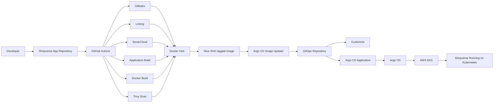

# Shopverse E-commerce Application - GitOps delivery

Shopverse is a full-stack e-commerce application built as part of my production-oriented DevOps portfolio project.

This repository contains the **application source code, Dockerfiles, and Continuous Integration (CI) pipeline**.

The deployment side is intentionally maintained in a separate GitOps repository using **Kubernetes, Kustomize, Argo CD, Argo CD Image Updater, and AWS EKS**.

The goal of this project is to demonstrate a complete, traceable path from:

**Application Code → Secure CI → Container Image → GitOps → Kubernetes Deployment**

---

# Architecture

## Project Overview

Shopverse is designed to demonstrate how a modern application can be integrated into a secure CI/CD workflow without tightly coupling application source code with deployment configuration.

The project uses two separate repositories:

### Application Repository
This repository:

- Contains frontend and backend source code
- Builds and validates the application
- Performs security and code-quality checks
- Builds Docker images
- Scans container images for vulnerabilities
- Publishes immutable SHA-tagged images to Docker Hub

### GitOps Repository
The deployment configuration is maintained separately.

It contains:

- Kubernetes manifests
- Kustomize configuration
- Argo CD Application configuration
- Argo CD Image Updater configuration
- AWS/EKS deployment configuration
- Infrastructure configuration

### Deployment Repository

**Shopverse GitOps Repository:**  
https://github.com/Cloud-by-Yash/ShopVerse-GitOps-DevSecOps

Keeping these responsibilities separate allows the application repository to focus on **building software**, while the GitOps repository represents the **desired deployment state**.

---

